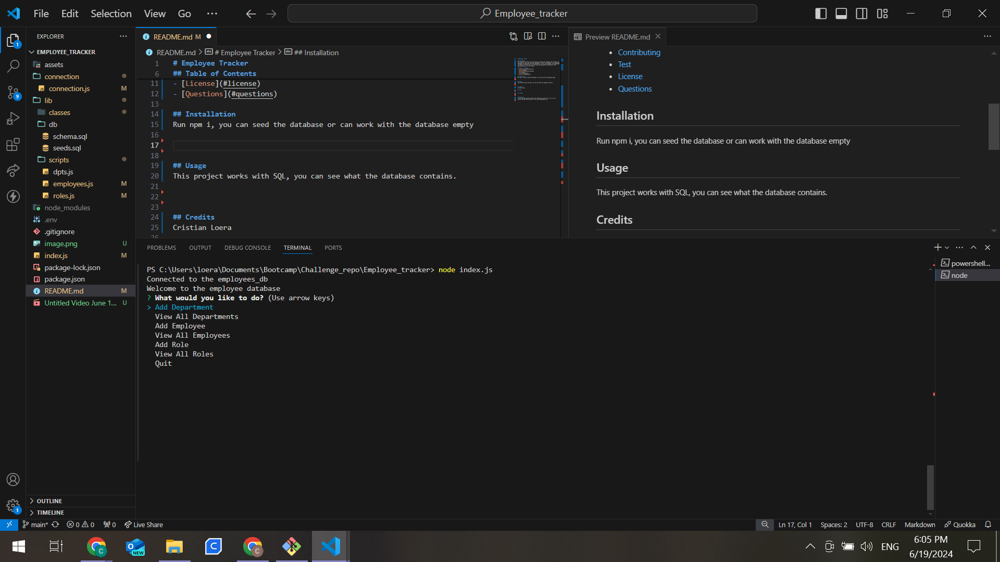
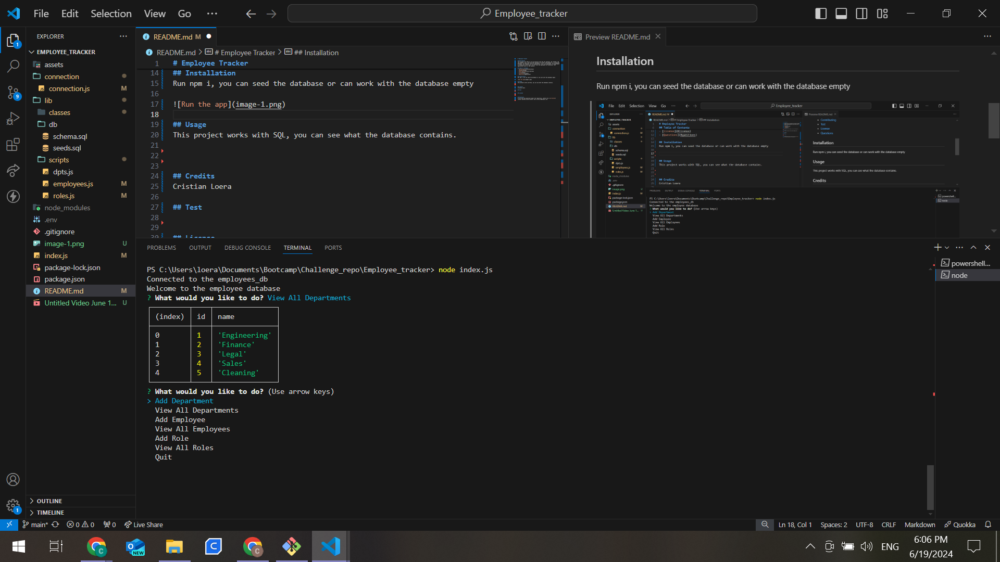
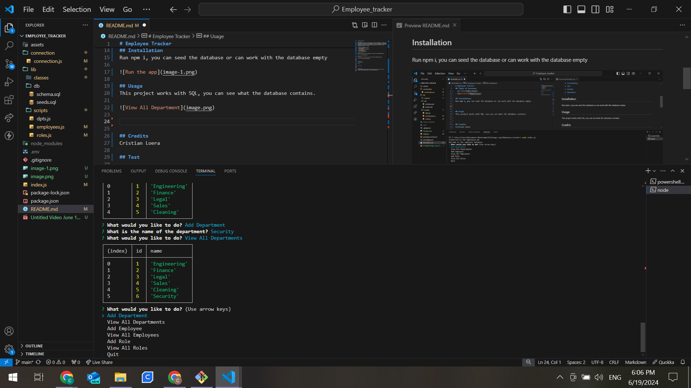
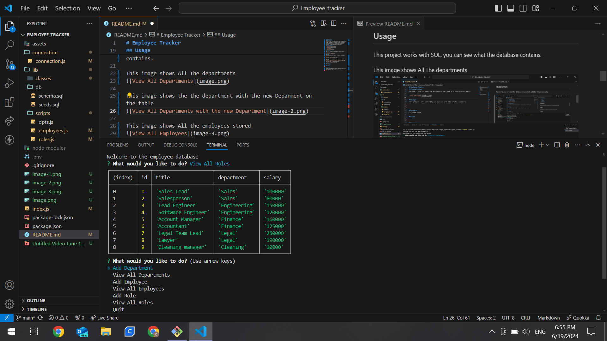
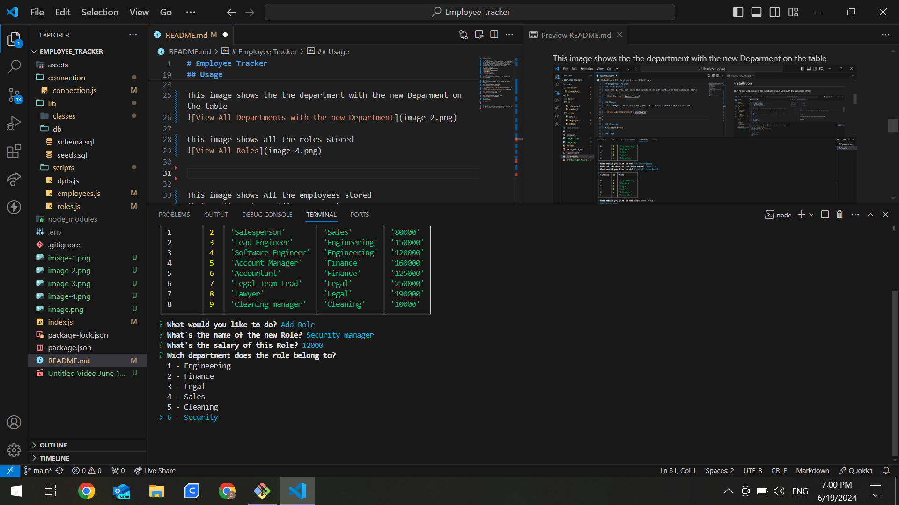
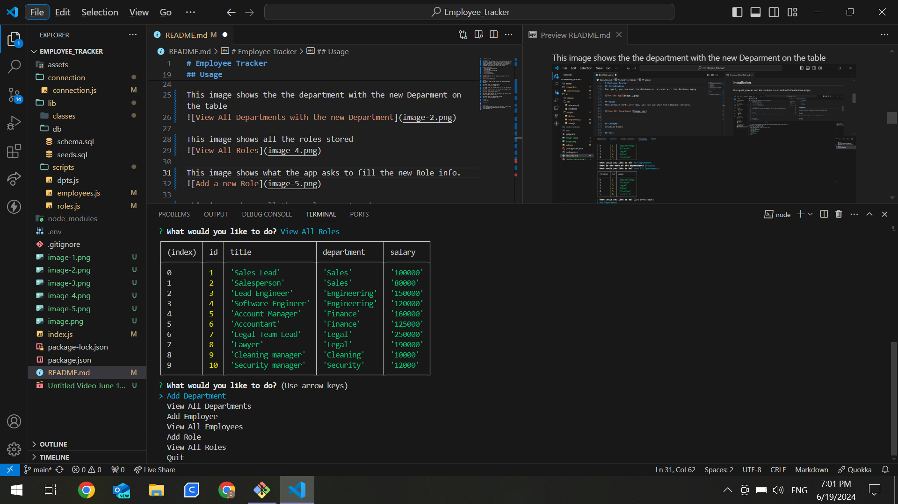
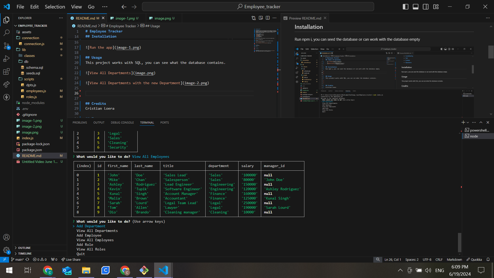
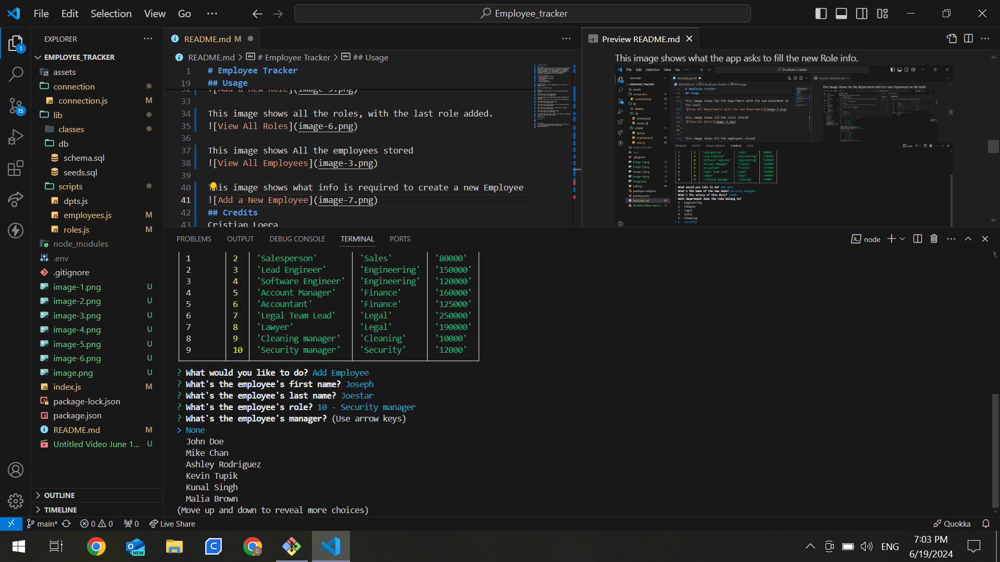

# Employee Tracker  

## Description 
This project was made so we can practice with the sql postgres. We created a db and seeded to sql, and with that database we worked. The database is an employee database. 

The database contains departments, role, and employees. The department is connected to the roles, as the roles and employees are connected. This application works in the console. 

## Table of Contents 
- [Installation](#installation)
- [Usage](#usage)
- [Contributing](#contributing)
- [Test](#test)
- [License](#license)
- [Questions](#questions)

## Installation 
Run npm i, you can seed the database or can work with the database empty, then start the app with node index.js

## Usage
This project works with SQL, you can see what the database contains.

This image shows All The departments

This image shows the the department with the new Deparment on the table

This image shows all the roles stored.

This image shows what the app asks to fill the new Role info.

This image shows all the roles, with the last role added.

This image shows All the employees stored 

This image shows what info is required to create a new Employee

## Credits
Cristian Loera

## License

## Questions
If you have any questions about the repository, contact me in [el-bicho7](https://github.com/el-bicho7) and @ loera_73@hotmail.com

